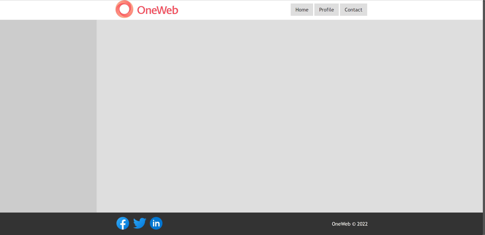

# Práctica 1 - HTML

Tu misión en este reto es crear una página. El resultado final debe quedar igual al que se muestra a continuación:

### Instrucciones

1. En el archivo index.html agrega la estructura básica que debe tener todo HTML.
2. Usar etiquetas semánticas `<header>`, `<main>`, `<aside>`, `<footer>`, `<nav>`.
3. Las imagenes las puedes descargar de los siguientes enlaces [Logo](https://upload.wikimedia.org/wikipedia/commons/2/2c/OneWeb_Logo.png), [Icono faceboo](https://img.icons8.com/fluency/48/undefined/facebook-circled.png), [Icono twitter](https://img.icons8.com/fluency/48/undefined/twitter.png), [Icono linkedin](https://img.icons8.com/fluency/48/undefined/linkedin-circled.png).
4. Los estilos los debes crear en un archivo externo y vincularlo al HTML.
5. Utiliza flex-box para alinear los elementos.
6. Usa un container max de 800px de ancho.
7. Hacer un push al repositorio de github con la solucion
